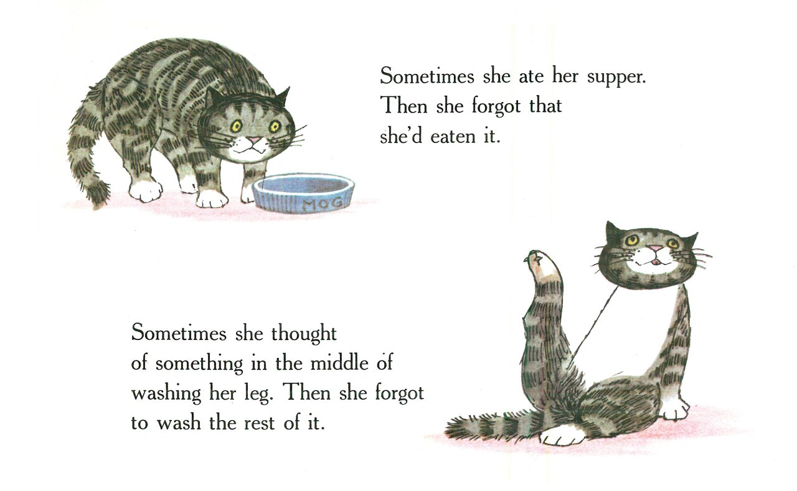

## What's this?

This is a repo of jest examples. Jest is a JS test framework.

 I use jest, then I forget how to use jest. A bit like mog the forgetful cat...

The audience of this repo is pretty much **me**, but if you get something out of this that's cool. Much better resources have been written on this topic, such as:

* this [one](https://github.com/sapegin/jest-cheat-sheet)
* [devhints](https://devhints.io/jest)

I really don't like wasting time, so whenever I've been stuck on (and then become unstuck) a jest scenario, I'll add it here, in the hopes of preventing history repeating itself.

👊🏼